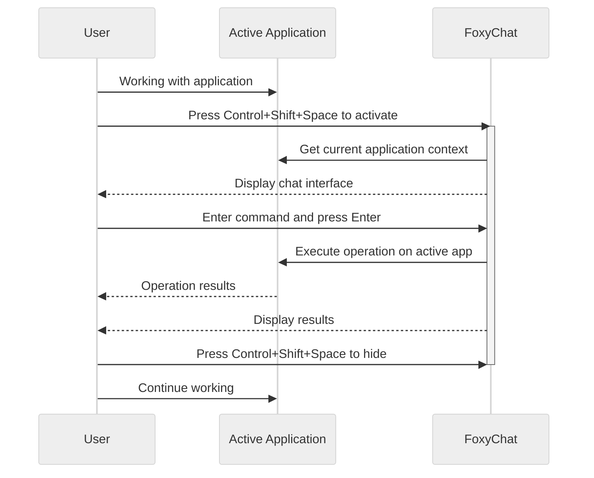

## ChatFox Interaction Workflow



## Workflow Description

1. **Activation Flow**:

   - User works with active application
   - Presses global hotkey (Control+Shift+Space)
   - ChatFox window appears and gains focus

2. **Command Processing Flow**:

   - User enters command and presses Enter
   - ChatFox sends command and context to server
   - Server uses MCP to find and execute appropriate tools

3. **Execution Flow**:

   - MCP tools directly control active application
   - Operation results are provided back to user
   - User can hide ChatFox with hotkey to continue working

4. **Integration Benefits**:
   - No need to switch application context
   - Natural language control of active applications
   - Unified tool interface through MCP

```

```
